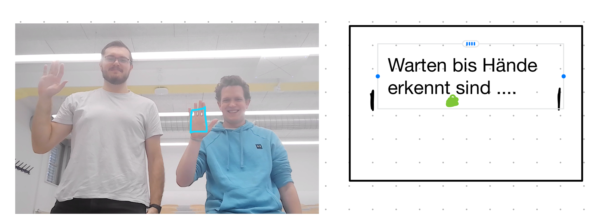
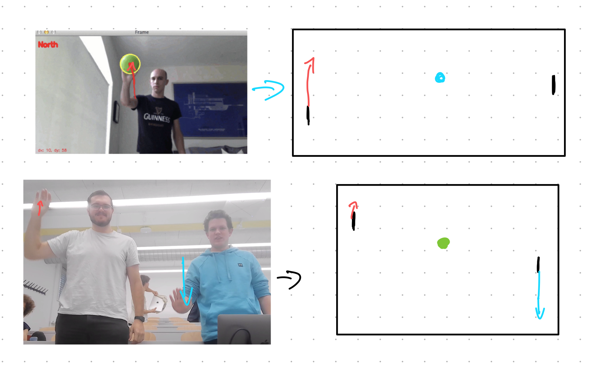

# Gesture-Pong
Unser Ziel ist es eine Schnittstelle zwischen Mensch und Maschine zu erstellen, die es erlaubt ohne Tastatur durch das Bewegen der Hände das Spiel Pong zu steuern. Dafür haben wir uns folgende Teilziele gesetzt:
## Ziele
 - [ ] Pong als Spiel programmieren
 - [ ] Mithilfe von OpenPose/OpenCV  Position von einer Hand einlesen
 - [ ] Schnittstelle zwischen Gestik und Pong realisieren
### Optionale Ziele
 - [ ] Einzelspieler- & Mehrspielermodus
 - [ ] Mithilfe von OpenPose/OpenCV Position von mehrern Händen einlesen (Einer oder Zwei Personen)

## Vorgehensweise & Technologien
 ### Vorgehensweise
**Generelle Vorgehensweise** (Projektplanung und Setup):
    - Definiere die genauen Anforderungen und Ziele des Projekts.
    - Erstelle ein Repository auf GitHub.
    - Installiere alle notwendigen Tools und Bibliotheken (Python, Pygame, OpenPose/OpenCV).
 **Iterationsplan**
- Grundlegendes Pong-Spiel entwickeln
    - Implementieren des Grundgerüst des Spiels in Pygame.
    - Erstellen der Spiellogik für den Einzelspieler.
- Entwicklung vom OpenPose/OpenCV Modul
    - Installation und konfiguration von OpenPose/OpenCV.
    - Entwickeln eines Moduls, das die Position einer Hand erkennt und auf benutzbare Art wiedergibt.
    - Implementieren einer Kalibrierungsfunktion, um die Gestenerkennung an verschiedene Benutzer anzupassen.
 - Schnittstelle zwischen Gestik und Pong
    - Entwickeln einer Schnittstelle, die die Paddles mithilfe der Handgestik bewegt.
       - Handbewegung nach oben (nördlich) und unten (südlich) bewegen die Paddles entsprechend nach oben und unten. Zum Start müssen beide erkennt werden.
    - Integration der beiden Module (Pong- und Gestikmodul)
- Erweiterung auf mehrere Hände und Spieler
    - Modifizieren des Skripts, um die Positionen von mehreren Händen zu erkennen.
    - Anpassen der Spiellogik, um Eingaben von zwei Spielern zu verarbeiten.
- Präsentation
    - Vorbereiten einer Präsentation mit Live Demo der Schnittstelle.
### Technologien
 - Python als programmiersprache
 - Pygame als Gameengine
 - OpenPose/OpenCV als Gestikerkennung
## Skizze

Nach dem auswählen des Spielmodus (hier Zweispieler) wartet das Spiel, bis es die erwartete Anzahl (rechte) Hände erkennt wird. Wird während des Spiels das Tracking verloren so gibt es nach einer kleinen Pufferzeit (um das Tracking vielleicht wieder zu erkennen) eine Pausierung des Spiels. Zum Ende des Spiels wird das Tracking abgeschaltet.

Der Benutzer kann mithilfe von Handbewegung in nördliche oder südliche Richgung die Höhe des Paddles bestimmen. Dabei gibt die Höhenänderung der Hand an wieviel und wie schnell das Paddle sich bewegen sollte. Dies sollte für ein bis optional zwei Spieler funktionieren. Die Steuerung im Spielmenu wird klassisch über Tastatur und Maus verfügbar sein und ist nicht Teil der Schnittstelle.
